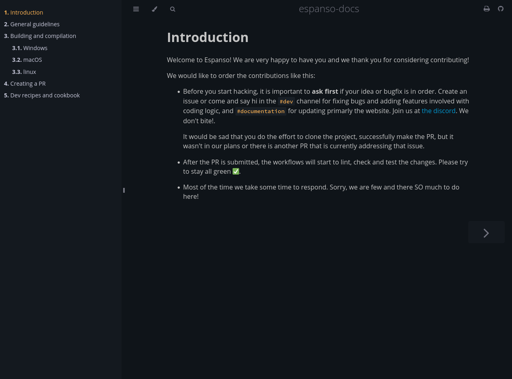

# Espanso Developer docs

This sub folder corresponds to the developer documentation. If you are looking
to the user documentation it's [on the webpage](https://espanso.org/).



## Description

- `./docs` is the source directory of the book
- `./docs/src/SUMMARY.md` configures the order of the menu on the left hand side
  of the book ([more info here](https://rust-lang.github.io/mdBook/format/summary.html)).
"Without this file, there is no book."
- `./docs/assets` stores all the non-markdown content (screenshots, gifs) to be
  used.

## Building instructions (Install mdBook)

- from source

```
cargo install mdbook
```

- if you have `cargo-binstall`

```
cargo binstall mdbook
```

- or, you can also install it via `scoop` or Homebrew, or `nix-packages`

## run the book locally

To see the website update in real-time while you edit the content, you can use
`mdbook serve --open` instead of the build argument

```
mdbook serve --open
```

If you want to build it just once, run mdbook build in this directory.

```
mdbook build --open
```

And it's generated at `build/index.html`

## `Couldn't open SUMMARY.md`

If you see this error:

```console
2025-01-17 07:30:25 [ERROR] (mdbook::utils): Error: Couldn't open SUMMARY.md in "/home/acoyan/repos/espanso-upgrade-contributing/src" directory
2025-01-17 07:30:25 [ERROR] (mdbook::utils): 	Caused By: No such file or directory (os error 2)
```

Make sure you are in the repo folder, inside `docs/` subfolder.

```
$ pwd
/your/repo/location/espanso/docs
```
